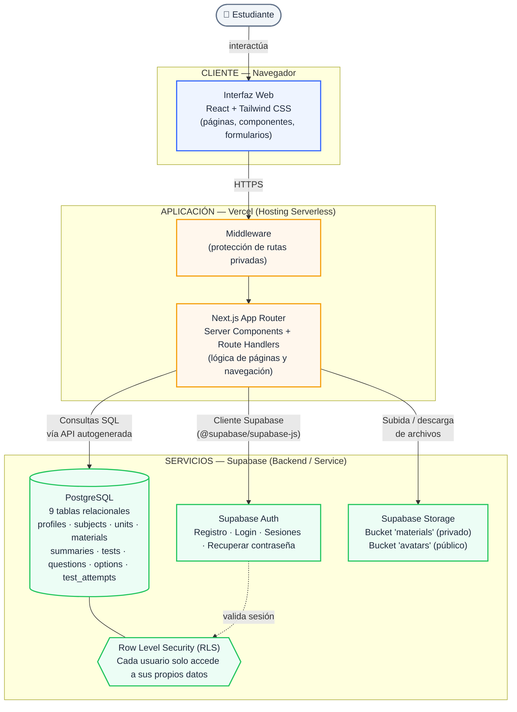

# EduVault Modular

Plataforma web educativa para que estudiantes universitarios organicen su material académico:
**Usuario → Asignaturas → Unidades → Material de estudio → Resúmenes → Tests**.

> ✅ **MVP completo — Sprints 1 a 6 terminados**
> Este repositorio contiene la plataforma completa: **Autenticación**, **Dashboard**,
> **Gestión académica** (Asignaturas, Unidades, Material con Supabase Storage), **Resúmenes y
> Tests** (con preguntas de alternativas), **Evaluación** (rendir tests, resultados, historial,
> sección de Progreso), **Perfil de usuario** (editar nombre, foto de perfil, cambiar
> contraseña), y una vista global de **"Tests"** en el menú lateral que lista todos tus tests
> agrupados por asignatura. Incluye manejo de errores (página 404 personalizada, error boundary
> global) y estados de carga.

## Stack

- **Frontend:** Next.js 14 (App Router) + React + TypeScript + Tailwind CSS
- **Backend/servicios:** Supabase (Authentication, PostgreSQL, Storage, Row Level Security)
- **Despliegue:** Vercel (frontend) + Supabase (backend)

## 1. Requisitos previos

- Node.js 18.18 o superior
- Una cuenta gratuita en [supabase.com](https://supabase.com)

## 2. Instalación

```bash
git clone [repositorio]
cd eduvault-modular
npm install
```

## 3. Configurar Supabase

### 3.1 Crear el proyecto

1. Entra a [supabase.com](https://supabase.com) → **New Project**.
2. Elige nombre, contraseña de base de datos y región.

### 3.2 Crear las tablas

En el **SQL Editor** de tu proyecto Supabase, ejecuta en este orden:

1. `supabase/schema.sql` — crea las 9 tablas, relaciones, índices y triggers.
2. `supabase/rls_policies.sql` — activa Row Level Security en todas las tablas
   y crea las políticas para que cada estudiante solo acceda a sus propios datos.

### 3.3 Configurar Storage

1. Ve a **Storage** → **New bucket**.
2. Crea un bucket llamado `materials` (privado, sin "Public bucket" activado).
3. Crea un segundo bucket llamado `avatars`, esta vez **con "Public bucket" activado**
   (así las fotos de perfil se muestran sin necesidad de URLs firmadas).
4. Vuelve al **SQL Editor** y ejecuta `supabase/storage_policies.sql` y
   `supabase/avatar_policies.sql` — sin esto, nadie podrá subir ni descargar archivos
   aunque los buckets existan.

### 3.4 Datos de prueba (opcional)

1. Regístrate una vez en la app (`/register`) para crear tu primer usuario real.
2. En **Authentication → Users**, copia el UUID de ese usuario.
3. Abre `supabase/seed.sql`, reemplaza `REEMPLAZA_CON_USER_ID` por ese UUID.
4. Ejecuta el script en el SQL Editor.

### 3.5 Variables de entorno

En **Project Settings → API**, copia la URL y la `anon public key`:

```bash
cp .env.example .env.local
```

Completa `.env.local`:

```
NEXT_PUBLIC_SUPABASE_URL=https://tu-proyecto.supabase.co
NEXT_PUBLIC_SUPABASE_ANON_KEY=tu-clave-anonima
```

`.env.local` ya está en `.gitignore`: nunca se sube al repositorio.

## 4. Ejecutar en desarrollo

```bash
npm run dev
```

Abre [http://localhost:3000](http://localhost:3000).

## 5. Probar lo que ya funciona

1. Ve a `/register`, crea una cuenta (nombre, correo, contraseña ≥ 8 caracteres con letras y números).
2. Revisa tu correo y confirma la cuenta (si tienes confirmación de correo activada en Supabase Auth).
3. Inicia sesión en `/login`.
4. Verás el `/dashboard` con tus estadísticas (0 al inicio, o los datos de `seed.sql` si los cargaste).
5. Prueba `/forgot-password` para el flujo de recuperación de contraseña.
6. Intenta entrar a `/dashboard` sin sesión iniciada: el middleware te redirige a `/login`.
7. Ve a `/subjects` y crea tu primera asignatura (nombre, código, descripción, color).
8. Entra a la asignatura y crea unidades; prueba reordenarlas con las flechas ↑ ↓.
9. Entra a una unidad y agrega material: prueba los tipos "Apunte"/"Texto" (sin archivo),
   "PDF"/"Documento" (sube un archivo real) y "Enlace" (con una URL).
10. Haz clic en "Descargar archivo" o "Abrir enlace" para confirmar que la descarga funciona.
11. En la pestaña "Resúmenes" de una unidad, crea un resumen (título + contenido) y verifica que puedas editarlo/eliminarlo.
12. En la pestaña "Tests", crea un test y agrégale preguntas: cada pregunta necesita al menos 2 alternativas y una marcada como correcta (círculo A/B/C...).
13. Entra al test y haz clic en "Realizar test". Responde todas las preguntas y envíalas: verás tu puntaje, porcentaje y la revisión pregunta por pregunta (correcta en verde, tu error en rojo si aplica).
14. Ve a "Mi progreso" en el menú lateral: verás tus estadísticas generales, el progreso por asignatura y el historial de tests rendidos.
15. Ve a "Mi perfil": cambia tu nombre y súbete una foto de perfil (requiere el bucket `avatars` del paso 3.3).
16. Ve a "Configuración": cambia tu contraseña y verifica que puedas volver a iniciar sesión con la nueva.
17. Prueba entrar a una URL que no existe (ej: `/subjects/algo-invalido/units/otro-invalido`) para ver la página 404 personalizada.

## 6. Estructura del proyecto

```
eduvault-modular/
├── app/
│   ├── page.tsx              # Landing page
│   ├── login/                # Login
│   ├── register/             # Registro
│   ├── forgot-password/      # Recuperar contraseña
│   ├── auth/                 # Callback de confirmación + reset de contraseña
│   ├── not-found.tsx         # Página 404 personalizada
│   ├── error.tsx             # Error boundary global
│   └── (private)/            # Rutas protegidas por middleware
│       ├── layout.tsx        # Sidebar + Navbar móvil
│       ├── loading.tsx       # Estado de carga durante la navegación
│       ├── dashboard/        # Dashboard con estadísticas
│       ├── subjects/
│       │   ├── page.tsx                          # Lista de asignaturas (CRUD)
│       │   └── [subjectId]/
│       │       ├── page.tsx                      # Detalle asignatura + CRUD unidades
│       │       └── units/[unitId]/
│       │           ├── page.tsx                   # Detalle unidad: Material, Resúmenes, Tests
│       │           └── tests/[testId]/
│       │               ├── page.tsx                # Gestión de preguntas + historial de intentos
│       │               └── take/page.tsx            # Rendir el test y ver resultado
│       ├── progress/page.tsx  # Mi progreso: estadísticas y por asignatura
│       ├── profile/page.tsx   # Mi perfil: nombre, avatar, estadísticas
│       └── settings/page.tsx  # Configuración: cambiar contraseña
├── components/
│   ├── ui/                   # Button, Input, Card, Toast, ConfirmDialog, Tabs...
│   ├── sidebar/ · navbar/    # Navegación
│   ├── subject/              # SubjectCard, SubjectFormModal
│   ├── unit/                 # UnitListItem, UnitFormModal
│   ├── material/             # MaterialCard, MaterialFormModal
│   ├── summary/              # SummaryCard, SummaryFormModal
│   ├── test/                 # TestListItem, TestFormModal, QuestionCard/FormModal, TakeTestQuestion
│   ├── progress/              # SubjectProgressCard
│   └── profile/                # Avatar
├── lib/
│   ├── supabase/             # client.ts, server.ts, middleware.ts, storage.ts, avatar.ts
│   └── utils/                # validaciones, helpers
├── types/database.ts         # Tipos TS del esquema completo
├── supabase/
│   ├── schema.sql
│   ├── rls_policies.sql
│   ├── storage_policies.sql
│   ├── avatar_policies.sql
│   └── seed.sql
├── middleware.ts             # Protección de rutas privadas
└── .env.example
```

## 7. Despliegue en Vercel

**Checklist antes de desplegar:**

- [ ] Ejecutaste los 4 scripts SQL en tu proyecto de Supabase: `schema.sql`, `rls_policies.sql`, `storage_policies.sql`, `avatar_policies.sql`.
- [ ] Creaste los buckets `materials` (privado) y `avatars` (público) en Storage.
- [ ] Probaste localmente el registro, login, y al menos un flujo completo (crear asignatura → unidad → test → rendirlo).
- [ ] Si vas a producción real (no solo demo), considera activar "Confirm email" con un proveedor SMTP propio en Supabase Auth (el servicio de correo gratuito de Supabase tiene límites muy bajos).

**Pasos:**

1. Sube el repositorio a GitHub.
2. En [vercel.com](https://vercel.com), importa el repositorio.
3. Agrega las variables de entorno (`NEXT_PUBLIC_SUPABASE_URL`, `NEXT_PUBLIC_SUPABASE_ANON_KEY`) en **Project Settings → Environment Variables**.
4. En Supabase, ve a **Authentication → URL Configuration** y agrega la URL de tu deploy de Vercel (ej. `https://tu-proyecto.vercel.app`) tanto en "Site URL" como en "Redirect URLs" (necesario para que funcionen los enlaces de confirmación de correo y recuperación de contraseña en producción).
5. Deploy.

## 8. Diagrama de Arquitectura


## 9. Ideas para después del MVP

El MVP cubre el flujo completo descrito en el prompt maestro. Algunas mejoras posibles para
una siguiente iteración (fuera del alcance original):

- Editor de texto enriquecido para resúmenes (en vez de texto plano).
- Notificaciones o recordatorios de estudio.
- Exportar resúmenes o resultados a PDF.
- Modo oscuro.
- Compartir asignaturas/material entre estudiantes (hoy todo es privado por diseño).
